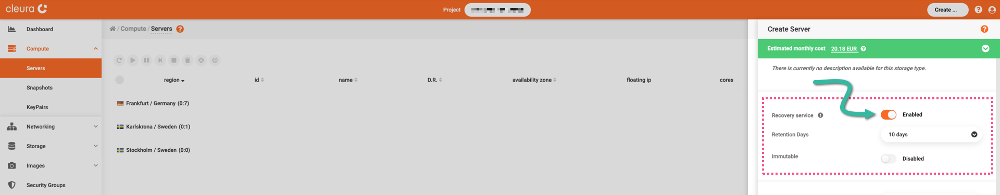
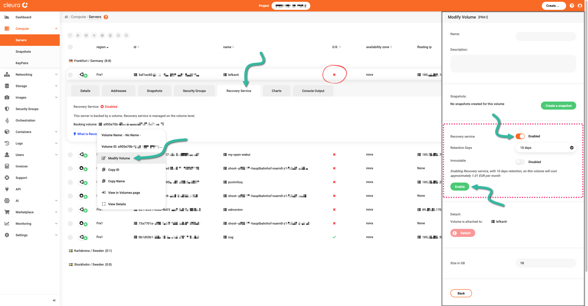
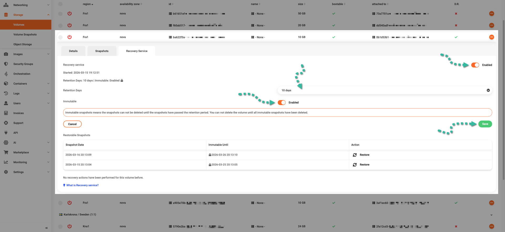

# Recovery service

When you [create a new server](../howto/openstack/nova/new-server.md) in {{brand}} you will notice an option named **Recovery service**, which is enabled by default.

Even if you choose to disable it for a particular server, keep in mind that you have the option to enable it at a later time.

In the following, we explain what this option does, how it works in the background, and why you should consider enabling it.

## What it is

The *recovery service* feature is available via the {{gui}} and applies to servers and volumes that use our [Ceph](https://docs.ceph.com/) backend.
That would be **all** servers but the ones of the `s` [flavor](../reference/flavors/index.md#compute-tiers).

## How it works

As soon as you enable the recovery service for a server or a single volume, you start getting snapshots for the corresponding [*RADOS Block Device* (RBD)](https://docs.ceph.com/en/latest/glossary/#term-Ceph-Block-Device) image.

Those snapshots are created automatically once per day.
By default, you have the snapshots of the last 10 days.
Optionally, you may choose to keep snapshots for the past 30 days.
The cost of a 30-day snapshot retention is 2&times; (**not** 3&times;) the cost of a 10-day snapshot retention.

You can also make the snapshots immutable.
In that case, you will not be able to delete snapshots during the retention period manually.

Keep in mind that you cannot delete a volume with snapshots.
So, as an example, if you have chosen a retention period of 30 days and also enabled immutability, then you will not be able to delete the volume before 30 days have passed.

At any time, you may disable the recovery service, modify the retention period, or disable immutability for snapshots.

Let's say, for instance, that you have enabled the recovery service and also the immutability feature for snapshots.
At some point, you want to change the retention period or disable immutability altogether;
you can do any of that.
Later on, you decide you do not need the volume anymore;
you disable the recovery service, wait for 10 or 30 days, and then delete the volume.

## Why enable it

Provided snapshots are available, you can restore a server or a single volume to any of those snapshots.
For instance, you may discover that due to faulty application logic or simply a bug, you are now experiencing data corruption.
Then, one of your options would be to [go back in time](../howto/openstack/nova/restore-srv-to-snap.md) by restoring one of the available snapshots and keep going from there.

## Restoration time

You should know that the recovery service feature creates *point-in-time* snapshots on the storage level.
The time required to restore a server to a particular snapshot depends on its size.
During restoration, the server is shut off.
After the restore, you need to power the server back on manually.
Although this whole process takes time analogous to volume size, as we pointed out, we should also note that it only takes seconds to complete on average.
