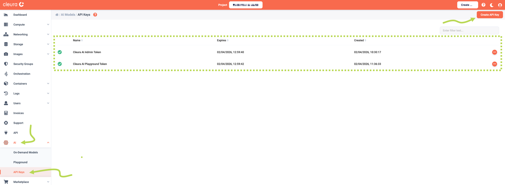
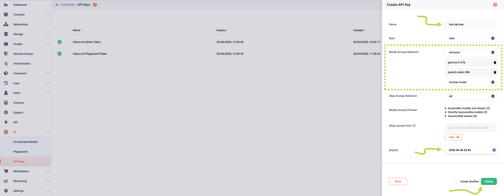
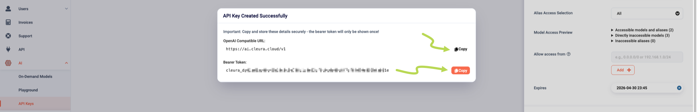
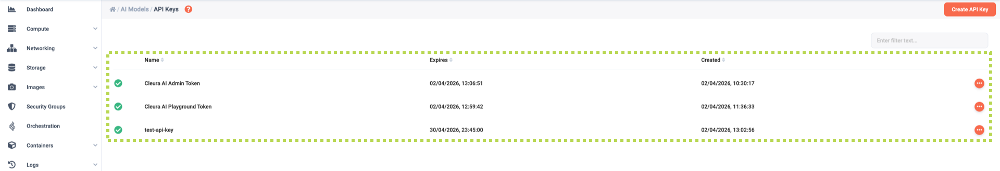
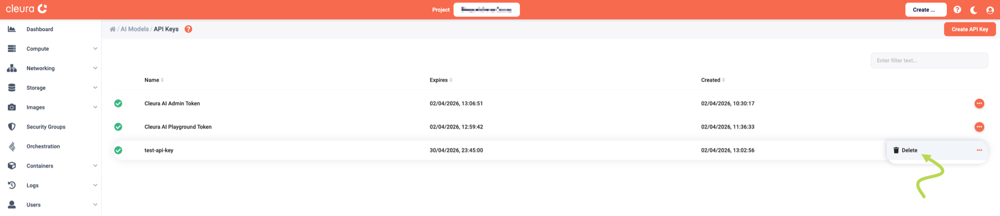
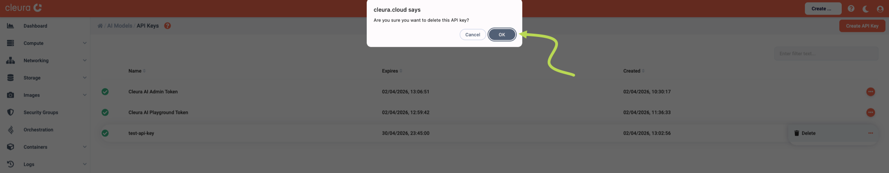
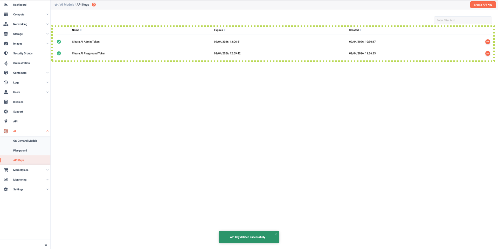

# Managing API keys

Whether you want to integrate a specific set of {{brand_ai}} LLMs into your application or web site, or access the models via a third party application you prefer, you first have to create an API key.

## Creating an API key

Expand the _AI_ section and select _API Keys_.
On the main pane, all existing API keys appear.
To create a new one, click the orange _Create API Key_ button.

A new pane slides over.
There, enter a _Name_ for the new API key.
Using the _Model Access Selection_ drop-down menu, you may have the new key pertain to all available {{brand_ai}} models (_All_), to specific models only (_Inclusive_), or to all but a few models (_Exclusive_).

You may also use the _Allow access from_ section, to allow access to the models from one or more networks only.
Please note that restricting the use of an API key to an IPv4 source network or to a set of IPv4 source networks, blocks using that key via IPv6 altogether.
Also, restricting API key access to an IPv6 source network is not possible.

Finally, you can set an expiration date for the API key;
beyond that date, access to any model using that key will not be possible.

When you are ready, click the green _Create_ button.

A new window titled _API Key Created Successfully_ pops up.

There are two pieces of information on that window that you need to jot down or, better yet, copy to a suitable password manager entry:

* The _OpenAI Compatible URL,_ and
* the _Bearer Token._

The bearer token is only displayed once, and as soon as you close the pop-up window you do not get to see the token again.

When you have secured the bearer token, click anywhere on the {{gui}} but on the pop-up window to close it.
You will then see all the API keys, including the one you just created, listed on the main pane.

## Deleting API keys

To delete an API key, first go to the _API Keys_ pane of the {{gui}}.
Locate the key you wish to delete, click the orange :material-dots-horizontal-circle: icon at the right of its row, and select _Delete_.

A popup window appears at the top of the page, asking if you really want to delete the key.
If you are sure you do not need the key anymore, click the _OK_ button.

This deletes the API key.
The list of keys is now shortened by one, and you get a confirmation on a green bubble at the bottom of the page.

