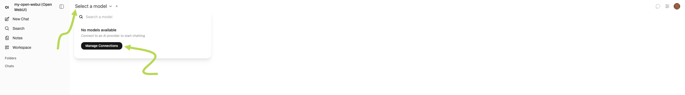
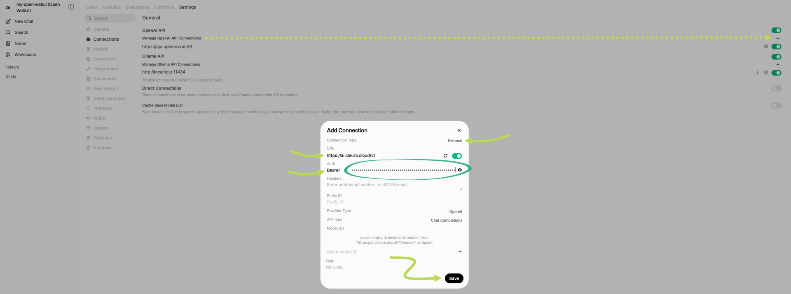
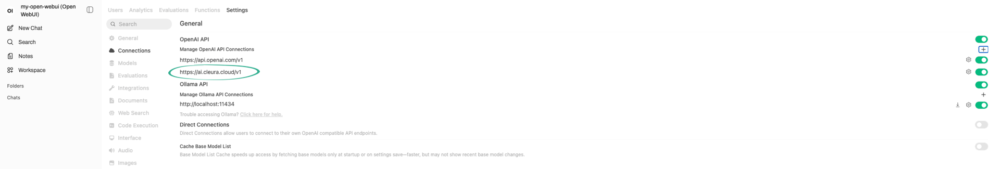
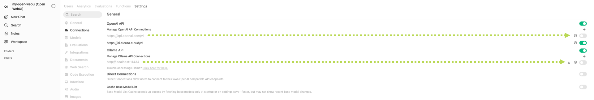
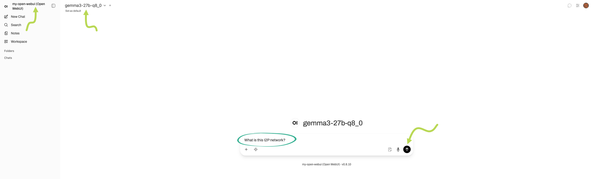
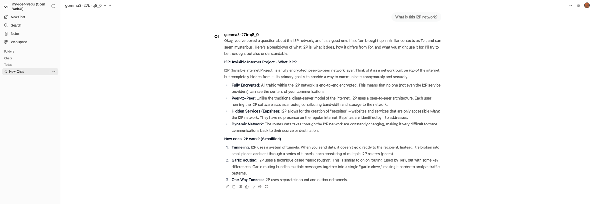

# Accessing via Open WebUI

Open WebUI is an open source web dashboard for interacting with LLMs via an OpenAI‑compatible API.

You can have an Open WebUI instance up and running in minutes, by [deploying it from the Marketplace](../marketplace/openwebui/deploy.md).

To proceed, make sure you have an [API key](api-keys.md) readily available.

## Adding {{brand_ai}} models

As soon as your Open WebUI instance is ready and you are logged in, click on _Select a model_, and then on the _Manage Connections_ button.

On the upper right-hand side of the new page that appears, click the :material-plus: icon.
A window labeled _Add Connection_ pops up.

* Set _Connection Type_ to _External_.
* Set _URL_ to `https://ai.cleura.cloud/v1`.
* Set _Auth_ to _Bearer_.

In the text field right of _Bearer_, paste your API key's bearer token.
Then, click the _Save_ button.

The _Add Connection_ window closes, and below the _Manage OpenAI API Connections_ list you see that `https://ai.cleura.cloud/v1` is included.

Since you are here, use the toggles to switch off the OpenAI and Ollama API connections.
That way, you know you'll be connecting to the {{brand_ai}} LLMs only.

## Interacting with {{brand_ai}} models

Expand the left sidebar and, at the top of it, click on the name of your Open WebUI instance.
Right next of the instance name, click the :material-chevron-down: icon and select one of the available {{brand_ai}} models.
Then, type in a question and click the :material-arrow-up-circle: icon to query the selected model.

In a bit, you will get an answer back.

