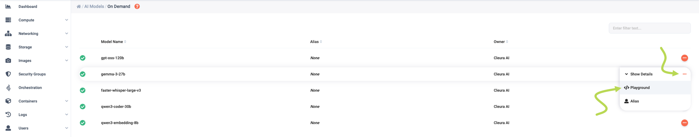
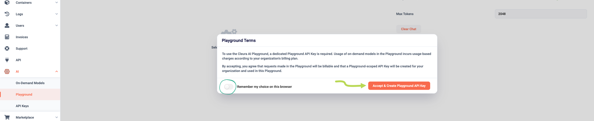
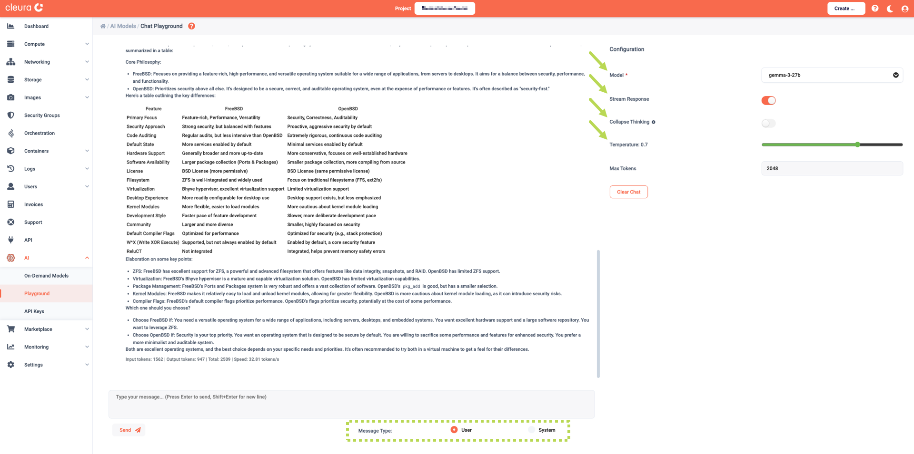

# Using the playground

In the {{gui}}, expand the vertical navigation bar at the left, click on _AI_, and then choose _On-Demand Models_.

All available LLMs are on the main pane.

## Interacting with a model

To start interacting with a specific model, click the orange :material-dots-horizontal-circle: icon at the right of its row and select _Playground_.

The first time you select a model, a pop-up window titled _Playground Terms_ appears.

Read the two short paragraphs regarding the terms.
Optionally, toggle the _Remember my choice on this browser_ option.
Provided you agree with the terms, click the orange _Accept & Create Playground [API Key](api-keys.md)_ button to proceed.

## Interacting with a model

In the _Chat Playground_ main pane, you can freely interact with any of the available models by asking questions.

Below the text box where you type-in your questions, you will notice the _Message Type_ parameter.
This can be either _User_ (the default) or _System_:

* When _Message Type_ is set to _User_, the LLM processes your questions as regular prompts.
* When it is set to _System_, the LLM adjusts its overall tone to what you're telling it ("from now on, be brief and dry", or "from now on, respond as a friendly and patient teacher").

Please take note of the _Configuration_ area, at the top right-hand side of the pane.

From the drop-down menu in the _Menu_ row, you may choose any of the available models to interact with.

Below, when the _Stream Response_ toggle is enabled, the answers appear gradually, resembling a live conversation with another human.
When that toggle is disabled, after a short pause the answers appear all at once.

There is also the _Collapse Thinking_ toggle.
When it is disabled, you get to inspect how the model arrives at its answer.
This is useful when you wish to debug a prompt, or wish to inspect the model's step‑by‑step logic.
When the toggle is enabled, you get a "cleaner" and easier to read output, which may be desirable when the chain‑of‑thought is long and you only care about the final answer.

Finally, by playing with the _Temperature_ parameter, you influence the creativity of the model while coming up with answers to your questions.
The higher the _Temperature_, the more freewheeling or creative the LLM becomes.
On the other hand, the lower the _Temperature_, the more deterministic or focused the LLM becomes.
