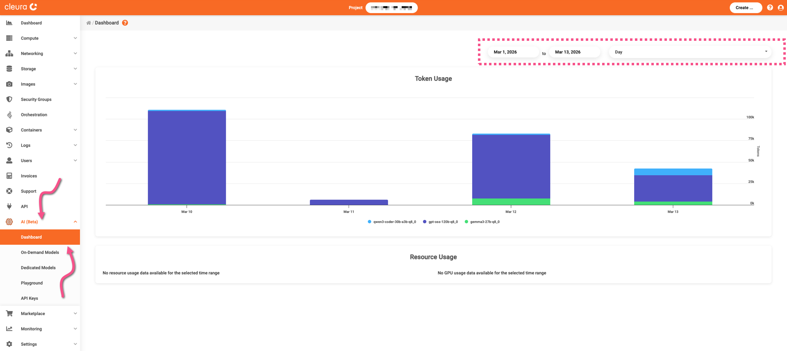
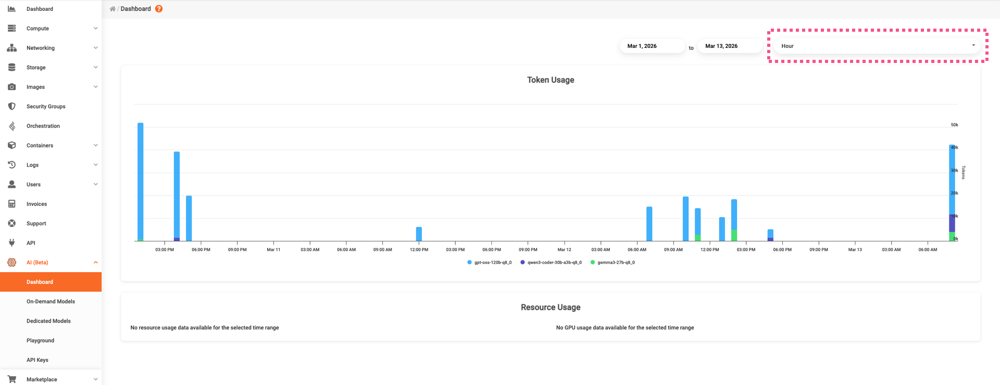
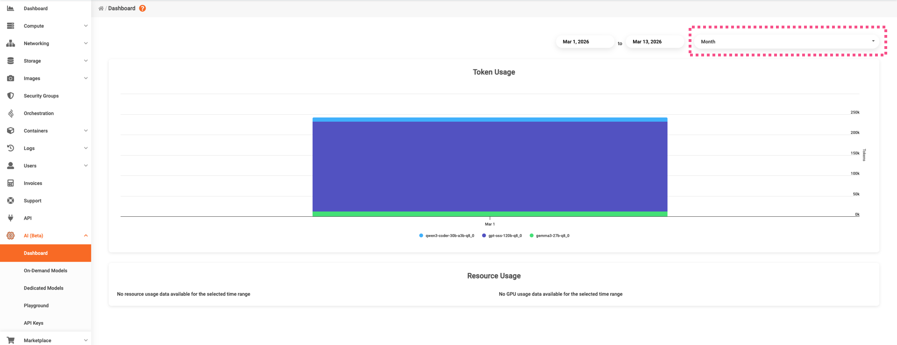

# Monitoring token usage

In the {{gui}}, expand the vertical pane at the left and click on _AI_.
To monitor your token usage, select _Dashboard_.
On the main page, also called _Dashboard_, you may have different graphical views of your token usage, always broken down by LLM.

You can, for instance, set a date-range, and then get a graphical overview of your daily token usage.

Alternatively, you can get a much closer look and ask for an hourly token usage.

If, on the other hand, you need a higher-lever overview, then go for a monthly graph of your token usage.

