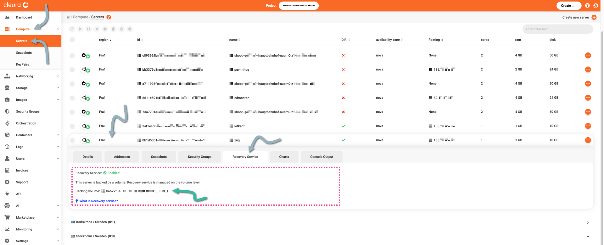
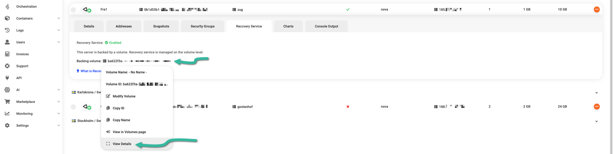
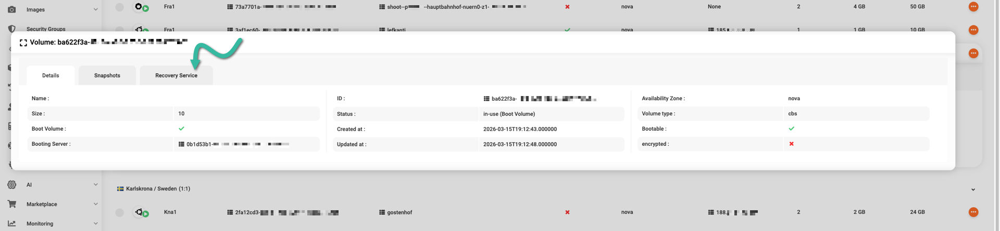
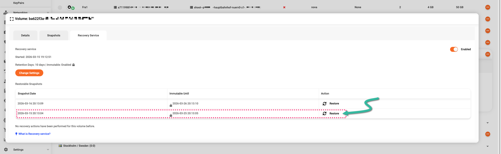
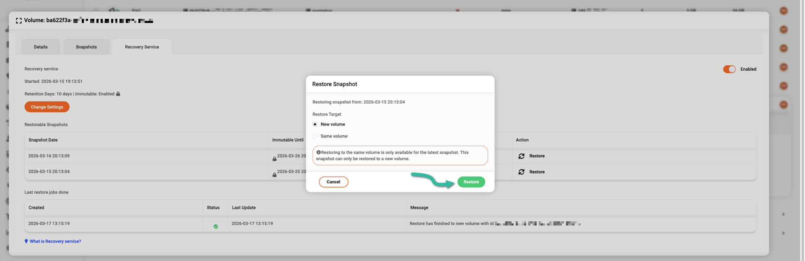
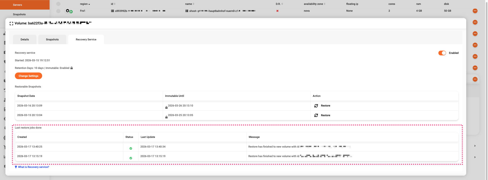
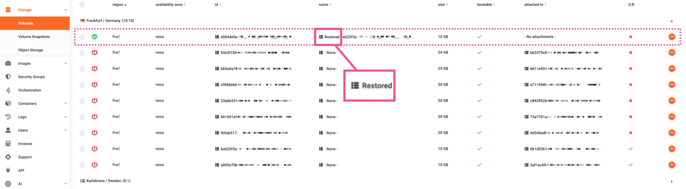
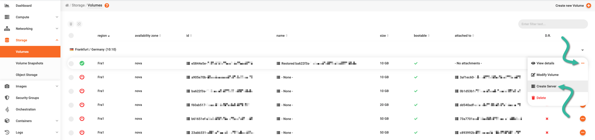

# Restoring a server to a snapshot

Servers in {{brand}} that have the [recovery service](../../../background/recovery-service.md) feature enabled can go back in time, meaning you may restore such a server to one of the available point-in-time snapshots.
Here is how you can do that.

## How to restore, step by step

To select a particular snapshot and restore your server to it, first off, navigate to the {{gui}}.
From the left-hand side vertical pane, choose Compute → [Servers](https://{{gui_domain}}/compute/servers).
In the central pane of the {{gui}}, locate the server of interest.
Click its row to bring all server details into view, then go to the *Recovery Service* tab.

Notice the _Backing volume_ and its ID.
Click the ID, and in the pop-up window that appears, select _View&nbsp;Details_.

A new pop-up window appears, displaying details about the server volume.
Select the _Recovery&nbsp;Service_ tab.

You now see all available volume snapshots.
You may restore the server to any of those.
Go ahead and click on the _Restore_ option of the latest snapshot.

A new window named _Restore Snapshot_ appears.

If the snapshot you are about to restore comes from a boot volume, like in the example here, then you can only restore the snapshot to a **new** volume.

Had you chosen to restore an **older** snapshot, then you could also restore it to a **new** volume.

The only time you can restore a snapshot to an existing volume is when the snapshot comes from a non-boot volume and is the newest.

To restore the selected snapshot, click the green _Restore_ button.

Restoring a snapshot may take some time, but in many cases the operation completes after a few seconds.
Check the messages at the bottom of the window for the latest restore jobs.

To see the new snapshot, from the left-hand side vertical pane of the {{gui}} choose Storage → [Volumes](https://{{gui_domain}}/storage/volumes).

You can spot the new volume by looking at the _name_ column;
its name is prefixed by "Restored" and immediately followed by the ID of the original volume.

You can now create a server from the new volume.
Click the orange :material-dots-horizontal-circle: icon at the left of the volume row, select _Create Server_, and work as you usually would while [creating a new server](new-server.md).

